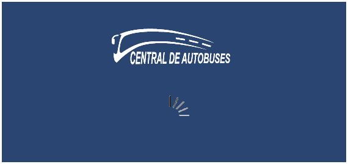
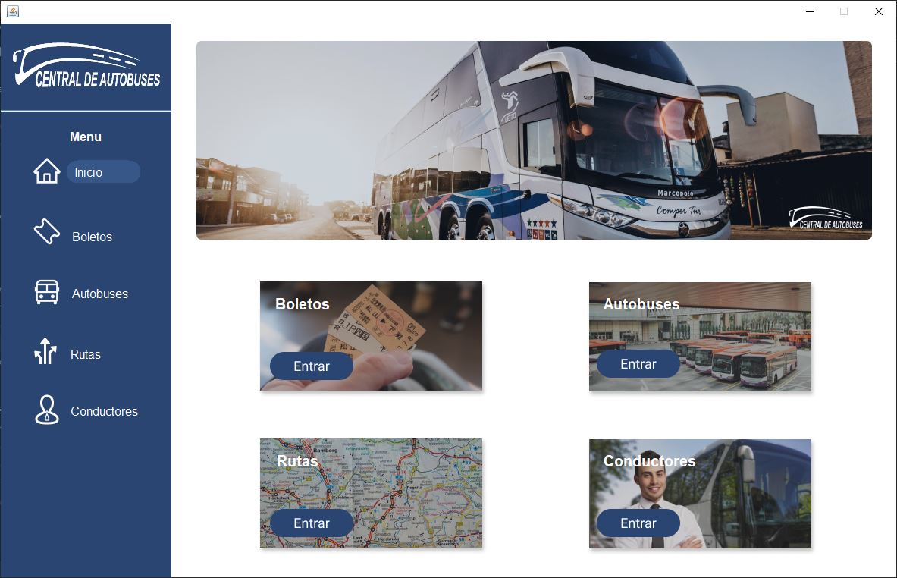
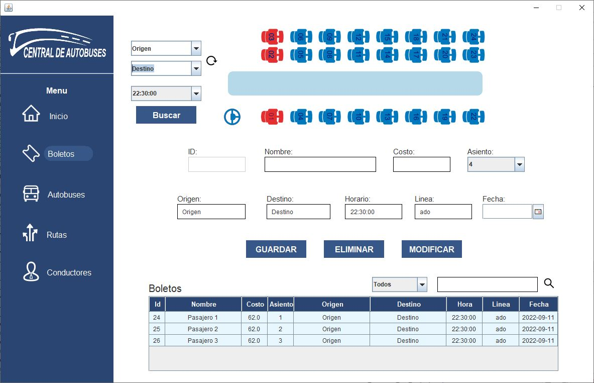
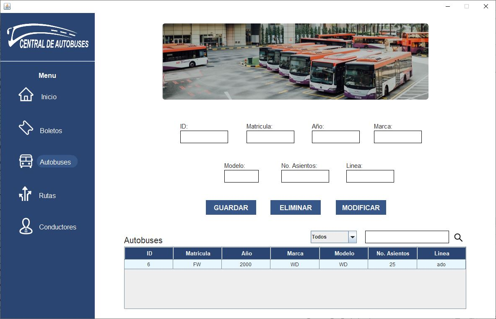
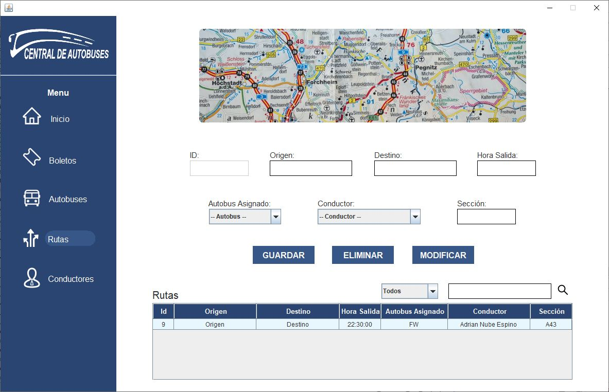
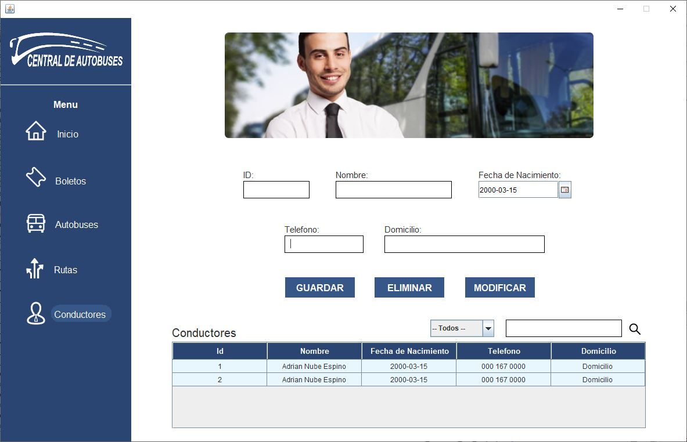

# Central de Autobuses con MVC

Este proyecto ya lo tenía desarrollo únicamente se implementó la arquitectura MVC para una mejor estructura.

# Capturas

## Ejecución del Sistema

## Inicio

## Boletos

## Autobuses

## Rutas

## Conductores

